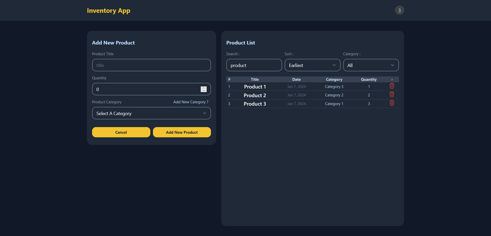

# Inventory App

## Table of contents

- [Overview](#overview)
- [How to run project](#how-to-run-project)
- [Screenshot](#screenshot)
- [Built with](#built-with)
- [What I learned](#what-i-learned)

### Overview

### How to run project

- npm install
- npm run dev

### Screenshot



### Built with

- [React](https://reactjs.org/) - JS library
- [tailwind](https://tailwindcss.com/) - For styles
- [heroicons](https://heroicons.com/) - For svg

### What I learned

- How to filter and sort data properly

```js
useEffect(() => {
  let allProducts = products;
  allProducts = filterSearchTitle(allProducts);
  allProducts = sortData(allProducts);
  allProducts = filterCategory(allProducts);
  setFilteredProducts(allProducts);
}, [products, searchValue, sortValue, categoryValue]);

const handleSearch = (e) => {
  setSearchValue(e.target.value.trim().toLowerCase());
};

const handleSort = (e) => {
  setSortValue(e.target.value);
};

const handleCategoryFilter = (e) => {
  setCategoryValue(e.target.value);
};

function filterSearchTitle(array) {
  return array
    .filter((product) => product.title.toLowerCase().includes(searchValue))
    .sort((a, b) => new Date(b.createdAt) - new Date(a.createdAt));
}

function sortData(array) {
  return [...array].sort((a, b) => {
    if (sortValue === "latest") {
      return new Date(b.createdAt) - new Date(a.createdAt);
    } else if (sortValue === "earliest") {
      return new Date(a.createdAt) - new Date(b.createdAt);
    }
  });
}
function filterCategory(array) {
  if (!categoryValue) return array;
  return array.filter((item) => item.category === categoryValue);
}
```
